# Complete Use Case Flows (Technical Deep Dive)

---

## 🏗️ 1. User Management

### 1.1 User Gets Registered
**Simple explanation:** When a user first installs the app, the app creates secret security keys on their phone. These keys are used to lock and unlock messages. The "public" part of these keys is sent to the server so friends can find and start a safe chat with the user.

```mermaid
sequenceDiagram
    participant User
    participant CDB as 💾 Client DB
    participant E2EE as 🔐 Client E2EE
    participant Server as ☁️ Server API
    participant SS as 🗄️ Server Storage

    User->>CDB: 1. Input Phone Number
    CDB->>Server: 2. Request OTP (POST /auth/otp)
    Server-->>CDB: 3. OTP Sent (200 OK)
    
    User->>CDB: 4. Input OTP "123456"
    CDB->>Server: 5. Verify OTP (POST /auth/verify)
    
    alt OTP Invalid
        Server-->>CDB: 400 Bad Request (Invalid OTP)
        CDB-->>User: Show Error "Wrong Code"
    else OTP Valid
        Server-->>CDB: 200 OK (Auth Token)
        
        CDB->>E2EE: 6. Generate Identity Key Pair
        CDB->>E2EE: 7. Generate Registration ID
        CDB->>E2EE: 8. Generate PreKeys (0-100) & Initial SignedPreKey
        
        E2EE->>CDB: 9. Store Private Keys (Encrypted)
        
        CDB->>Server: 10. Upload Public Key Bundle
        Server->>SS: 11. Store Bundle inside /keys/{userId}
        SS-->>Server: Success
        Server-->>User: 12. Registration Complete (200 OK)
    end
```

### 1.2 User Updates Account Info
**Simple explanation:** When a user changes their name or profile picture, the app updates the info on the phone and also sends it to the server. This way, other users can see the updated profile.

```mermaid
sequenceDiagram
    participant User
    participant CDB as 💾 Client DB
    participant Server as ☁️ Server
    participant SS as 🗄️ Server Storage

    User->>CDB: 1. Change Name to "Alice Pro"
    CDB-->>User: Show Loading Spinner
    
    CDB->>Server: 2. POST /profile {name: "Alice Pro"}
    
    alt Server Request Fails (e.g. 500 or Network Error)
        Server-->>CDB: Error (or Timeout)
        CDB-->>User: Show "Update Failed, Try Again"
        Note over CDB: Local DB is NOT updated.
    else Server Request Success
        Server->>SS: 3. Update /users/{id} Document
        SS-->>Server: Ack
        Server-->>CDB: 4. 200 OK (Updated Profile)
        
        CDB->>CDB: 5. Update Local User Table
        CDB-->>User: 6. Show "Profile Updated"
    end
```

### 1.3 User Looks for Friends Among Contacts
**Simple explanation:** The app looks at the phone numbers in the contact list. It turns these numbers into hidden codes and sends them to the server. The server checks which of these people are already using the app and tells your phone, so you can start chatting.

```mermaid
sequenceDiagram
    participant User
    participant Phone as 📱 Contact Book
    participant CDB as 💾 Client DB
    participant Server as ☁️ Server
    participant SS as 🗄️ Server Storage

    User->>Phone: 1. "Sync Contacts"
    Phone-->>CDB: 2. Return Raw List (+123, +456...)
    CDB->>CDB: 3. Hash Numbers (SHA256)
    
    CDB->>Server: 4. Send List of Hashes
    
    alt Network Error / Server Fail
        Server--xCDB: Request Failed
        CDB-->>User: Show "Sync Failed, Pull to Retry"
    else Success
        Server->>SS: 5. Query matching User Hashes
        SS-->>Server: Return Matches (UserIDs)
        
        Server-->>CDB: 6. Return Registered User List
        CDB->>CDB: 7. Save to 'Contacts' Table
        CDB-->>User: 8. Show Available Friends
    end
```

---

## 📨 2. Peer-to-Peer Messaging (1-on-1)

### 2.1 User A Sends Message to User B (First Time)
**Simple explanation:** To start a chat, User A's app gets User B's public keys from the server. Using these keys, the app sets up a secure connection and locks the message so only User B can read it.

```mermaid
sequenceDiagram
    participant UA as User A
    participant CA_DB as 💾 Client A DB
    participant CA_E2E as 🔐 Client A E2E
    participant Server as ☁️ Server
    participant SS as 🗄️ Server Storage
    participant CB_E2E as 🔐 Client B E2E
    participant CB_DB as 💾 Client B DB
    participant UB as User B

    UA->>CA_DB: 1. "Hi B"
    CA_DB->>CA_DB: 2. Check Session? (No)
    
    CA_DB->>Server: 3. Get PreKey Bundle (B)

    alt Network Error / Server Unreachable
        Server-->>CA_DB: Connection Failed
        CA_DB-->>UA: Show "Waiting for network..." (Queued)
    else Success
        Server->>SS: 4. Fetch Bundle
        SS-->>Server: Return Bundle
        Server-->>CA_E2E: 5. Receive {IK_B, SPK_B, OPK_B}
        
        CA_E2E->>CA_E2E: 6. X3DH Handshake (Derive Root Key)
        CA_E2E->>CA_DB: 7. Save New Session
        CA_E2E->>CA_E2E: 8. Encrypt "Hi B" (PreKeyMessage)
        
        CA_E2E->>Server: 9. Send Message
        Server->>SS: 10. Store in B's Inbox
        
        Note over Server, UB: Delivery depends on Online Status (See 2.3)
    end
```

### 2.2 User A Sends Message to Known User B (Ongoing)
**Simple explanation:** Once the chat has started, the app uses a different key for every single message. This makes the conversation extremely secure. The app locks the message, sends it, and prepares a new key for the next one.

```mermaid
sequenceDiagram
    participant UA as User A
    participant CA_DB as 💾 Client A DB
    participant CA_E2E as 🔐 Client A E2E
    participant Server as ☁️ Server
    
    UA->>CA_DB: 1. "How are you?"
    CA_DB->>CA_E2E: 2. Load Session (B)
    CA_E2E->>CA_E2E: 3. Ratchet Forward -> New Message Key
    CA_E2E->>CA_E2E: 4. Encrypt (SignalMessage)
    
    CA_E2E->>Server: 5. Send Message
    
    alt Network Failed
        Server--xCA_E2E: (No Response)
        CA_DB->>CA_DB: 6. Mark Message "Pending/Retry"
        Note over CA_DB: Background job retries later
    else Success
        Server-->>CA_E2E: 200 OK
        CA_DB->>CA_DB: 6. Mark Status "Sent"
        CA_DB->>CA_DB: 7. Update Session State (Ratchet moved)
    end
```

### 2.3 Online vs Offline Client Handling (The Inbox)
**Simple explanation:** If the receiver is online, the message is delivered immediately. If they are offline, the server saves the message in a temporary 'Inbox'. As soon as the receiver opens the app, they receive all saved messages, and the server deletes them forever.

### 2.4 User A Deletes Chat with User B
**Simple explanation:** Deleting a chat only removes it from your own phone. It does not delete anything from the other person's phone or the server. This is a local action for your own privacy.

### 2.5 User A Requests "Delete for Everyone" (User B Denies)
**Simple explanation:** If you try to delete a message for everyone, the other person's app receives a request. If they choose to deny it, the message stays on their phone. If they are offline, the request waits in their inbox.

```mermaid
sequenceDiagram
    participant UA as User A
    participant Server as Server
    participant SS as 🗄️ Server Storage
    participant UB as User B
    
    UA->>Server: 1. Send "DeleteRequest" for MsgID: 123
    
    alt User B is Offline
        Server->>SS: Store "DeleteRequest" in B's Inbox
        Note over Server: Delivered when B connects
    else User B is Online
        Server->>UB: 2. Deliver "DeleteRequest"
        UB->>UB: 3. "User A wants to delete msg 123. Allow?"
        UB->>Server: 4. "No" (Deny)
        Note over UB: Message remains on B's device.
    end
```

---

## 👥 3. Group Operations

### 3.1 User Creates a Group
**Simple explanation:** When you create a group and add friends, the server makes a record of the group. Your app then sends a special group-key to each member individually so everyone can talk to each other securely.

```mermaid
sequenceDiagram
    participant User
    participant CDB as 💾 Client DB
    participant E2EE as 🔐 Client E2EE
    participant Server as ☁️ Server
    participant SS as 🗄️ Server Storage

    User->>CDB: 1. Create Group "Team" (Add Bob, Charlie)
    CDB->>Server: 2. POST /groups/create {members: [A,B,C]}
    
    alt Validation Failed (e.g. Invalid Members)
        Server-->>CDB: 400 Bad Request
        CDB-->>User: Show "Group Creation Failed"
    else Success
        Server->>SS: 3. Create Group Document
        SS-->>Server: Return GroupID
        Server-->>CDB: 200 OK (GroupId)
        
        Note over E2EE: Sender Key Setup
        E2EE->>E2EE: 4. Generate 'SenderKey' Chain
        E2EE->>E2EE: 5. Encrypt SenderKey for Bob (1-to-1)
        E2EE->>E2EE: 6. Encrypt SenderKey for Charlie (1-to-1)
        
        E2EE->>Server: 7. Send 'Distribution Messages'
        Server->>SS: 8. Route to B and C Inboxes
    end
```

### 3.2 User Sends Message to Group
**Simple explanation:** When you send a group message, your app locks it once using your group-key. The server then sends this locked message to everyone in the group. Each member uses your key to unlock and read it.

```mermaid
sequenceDiagram
    participant User
    participant E2EE as 🔐 Client E2EE
    participant Server as ☁️ Server
    participant Group as 👥 Group Members

    User->>E2EE: 1. "Hello Team"
    E2EE->>E2EE: 2. Load My Sender Key
    E2EE->>E2EE: 3. Encrypt ONCE -> Ciphertext
    
    E2EE->>Server: 4. Send {GroupId, Ciphertext}
    
    alt Network Failure
        Server--xE2EE: (No Ack)
        E2EE->>E2EE: Queue for Retry (Backoff)
    else Success
        Server-->>E2EE: 200 OK
        Server->>Group: 5. Fan-out to Bob & Charlie
        
        Note over Group: Bob uses A's Sender Key to decrypt.
        Note over Group: Charlie uses A's Sender Key to decrypt.
    end
```

### 3.3 User Leaves Group
**Simple explanation:** When a user leaves a group, the server removes them from the member list. A system message is sent to the group to let everyone know that the user has left.

```mermaid
sequenceDiagram
    participant User
    participant Server as ☁️ Server
    participant SS as 🗄️ Server Storage

    User->>CDB: 1. Click "Leave Group"
    CDB->>Server: 2. POST /groups/{id}/leave
    
    alt Server Error
        Server-->>CDB: 500 Error
        CDB-->>User: Show "Could not leave group"
    else Success
        Server->>SS: 3. Remove UserID from 'members' array
        Server->>Server: 4. System Msg: "Alice left" -> Group Inbox
        Server-->>CDB: 5. 200 OK
        CDB->>CDB: 6. Local Delete / Mark Left
    end
```

---

## 🛡️ 4. Administration & Moderation

### 4.1 User Reports User B
**Simple explanation:** If a user is bothersome, you can report them. Your app sends a report to the admins. You can also choose to attach a few recent messages so the admins can see what happened.

```mermaid
sequenceDiagram
    participant User
    participant App as 📱 Client App
    participant Server as ☁️ Server
    participant AS as 🗄️ Admin Storage

    User->>App: 1. Report User B (Spam)
    App->>App: 2. Attach Last 5 Messages (Optional)
    App->>Server: 3. POST /reports {target: B, reason: Spam}
    
    alt Submission Failed
        Server-->>App: Error
        App-->>User: Show "Report Failed"
    else Success
        Server->>AS: 4. Create Ticket
        Note over AS: Admins review ticket.
        Server-->>App: 200 OK
        App-->>User: Show "Report Submitted"
    end
```

### 4.2 Administrator Bans User
**Simple explanation:** An admin can block a user if they break rules. The server disables their account, and the user will see a "Suspended" message on their phone.

```mermaid
sequenceDiagram
    participant Admin
    participant Server as ☁️ Server
    participant SS as 🗄️ Server Storage
    participant Target as 📱 Banned User

    Admin->>Server: 1. Ban User B
    
    alt DB Error
        Server-->>Admin: Show "Ban Failed"
    else Success
        Server->>SS: 2. Set user status = 'BANNED'
        Server->>SS: 3. Revoke Auth Tokens
        Server-->>Admin: Show "User B Banned"
    end
    
    Target->>Server: 4. Try Connect / Send
    Server-->>Target: 5. 403 Forbidden (Banned)
    Target->>Target: 6. Show "Account Suspended"
```

### 4.3 Administrator Broadcasts Message
**Simple explanation:** Admins can send an announcement to every single user at once (like for maintenance). These messages are sent in plain text, not encrypted, as they are public system messages.

```mermaid
sequenceDiagram
    participant Admin
    participant Server as ☁️ Server
    participant AllUsers as 👥 All Users
    
    Admin->>Server: 1. Send Broadcast "Maintenance at 2PM"
    Server->>Server: 2. Iterate All Active Users
    Server->>AllUsers: 3. Stream Message (System Channel)
    Note over AllUsers: Not E2E Encrypted (Plaintext System Msg)
```

### 4.4 Admin Queries DB (Stats)
**Simple explanation:** Admins can check reports inside the system, such as seeing which users have been offline for a long time or how many people are using the app.

```mermaid
sequenceDiagram
    participant Admin
    participant Server as ☁️ Server
    participant SS as 🗄️ Server Storage

    Admin->>Server: 1. Query: "Users offline > 30 days"
    Server->>SS: 2. SELECT * FROM users WHERE last_seen < NOW-30d
    SS-->>Server: 3. Return List
    Server-->>Admin: 4. Show Report
```

---

## 🏷️ 5. Special Features (Tags & "//" Entries)

### 5.1 User Tags User B (@mention)
**Simple explanation:** When you type @ followed by a name, the app finds that person's ID. It adds a tag to the message so the mentioned person knows they were called out in the chat.

### 5.2 User Queries All Users with Specific Tag
**Simple explanation:** You can search for people using tags, like searching for "#Doctor". The server looks through everyone's profile and shows you a list of people who have that tag.

```mermaid
sequenceDiagram
    participant User
    participant Server as ☁️ Server
    participant SS as 🗄️ Server Storage

    User->>Server: 1. Search Users with Tag "#Doctor"
    Server->>SS: 2. Query Index: users_by_tag
    SS-->>Server: 3. Return Matching Profiles
    Server-->>User: 4. List of Doctors
```

### 5.3 User Enters New "//" Entry (Slash Command / Note)
**Simple explanation:** If you type something starting with "//", like "//todo", the app saves it as a quick note on your phone. This information stays private on your device.

---

> This covers the technical flow of all 26+ requested use cases, detailing the interaction between Client DB, Crypto Engine, Server, and Server Storage.
